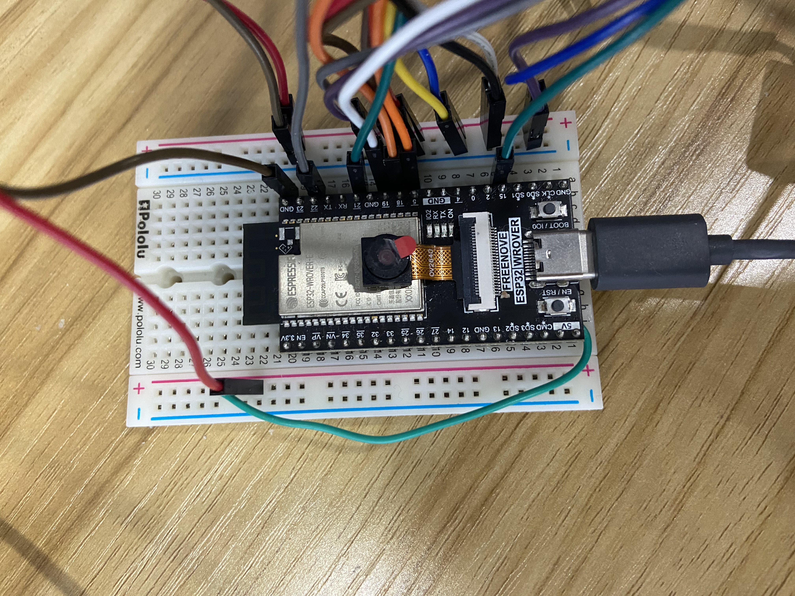

# ESP32-WEBBOT

<h2>Description </h2>

WebBot is a versatile project that integrates a web interface with a robotic system. Using React for the frontend and Node.js for the backend, it allows users to remotely control a robot arm via a browser. The project demonstrates real-time control and interaction, with functionalities for scheduling control sessions and monitoring through a camera feed.

<h2> Features </h2>

<h3> Camera </h3>
View the robot's surroundings in real time
<div align="center">
    
[](https://youtu.be/bBWBW29MAxo)
</div>

<h3> Control </h3>
Operate the robot arm from any web browser
<div align="center">

[](https://youtu.be/uBf7McVt6SU)
</div>

<h3> Booking Schedule and Reset password</h3>
Book time slots for controlling the robot. 
<div align="center">

[](https://youtu.be/tP2ydQP_NOY)
</div>

<h2>ESP32 Pins</h2>

This is my set up for the ESP32 with servo motors. 
<div align="center">




</div>

<h2>Before running </h2>

Need to create an .env file in the main directory

```
MYSQLDB_USER=
MYSQLDB_ROOT_PASSWORD=
MYSQLDB_LOCAL_PORT=
MYSQLDB_DOCKER_PORT=

REACT_APP_BACKEND_URL=

FRONTEND_URL= 
```

Need to create a config.h file in the **ESP32_main_service** folder

```
#ifndef CONFIG_H
#define CONFIG_H

#define WIFI_SSID "your-wifi-name"
#define WIFI_PASSWORD "your-wifi-password"
#define SERVER_IP "google-cloud-vm-external-ip-address"

#endif
```

Need to create a  secret-data.js file in **backend** folder

```
const bcrypt = require("bcrypt");

const jwtSecretkey = "";
const saltRounds = 5;
const generate_salt = async () => {
    const new_salt = bcrypt.genSalt(saltRounds);
    return new_salt;
}

const myEmail = "main-email";
const myEmailPassword = "password-for-app";

const default_user = "";
const default_password = "";
const default_database = "";
const default_host = "";
const admin_password = "";

module.exports = {
    jwtSecretkey, 
    generate_salt,
    default_user,
    default_password,
    default_database,
    default_host, 
    admin_password, 
    myEmail, 
    myEmailPassword, 
    user
}
```

<h2>NOTE </h2> 

For the myEmailPassword, it is ***NOT YOUR EMAIL PASSWORD***. 

It is obtained by go to *Google Account -> Security -> Enable 2-Step Verification -> App passwords -> Create a new app password*

<h2>Getting Started</h2>

1. Clone the repository:
    ```bash
    git clone https://github.com/hieuletainguyen/webbot.git
    ```
2. Navigate to the project directory:
    ```bash
    cd webbot
    ```
3. Navigate to the frontend directory and install dependencies:
    ```bash
    cd frontend
    npm install
    ```
3. Navigate back to the project directory, go to the backend directory and install dependencies:
    ```bash
    cd ../
    cd backend
    npm install
    ```
4. Complete the ***Before running*** step above
5. Navigate back to the project directory and start the docker compose:
   ```bash
   docker compose up -d
   ```
6. Stop the docker containers, remove all created images and volumes:
   ```bash
   docker compose down --rmi all -v
   ```


<h2 align="center"> &nbsp;Some Tools I Have Used and Learned In This Project</h2>
<p align="center">


</p>
